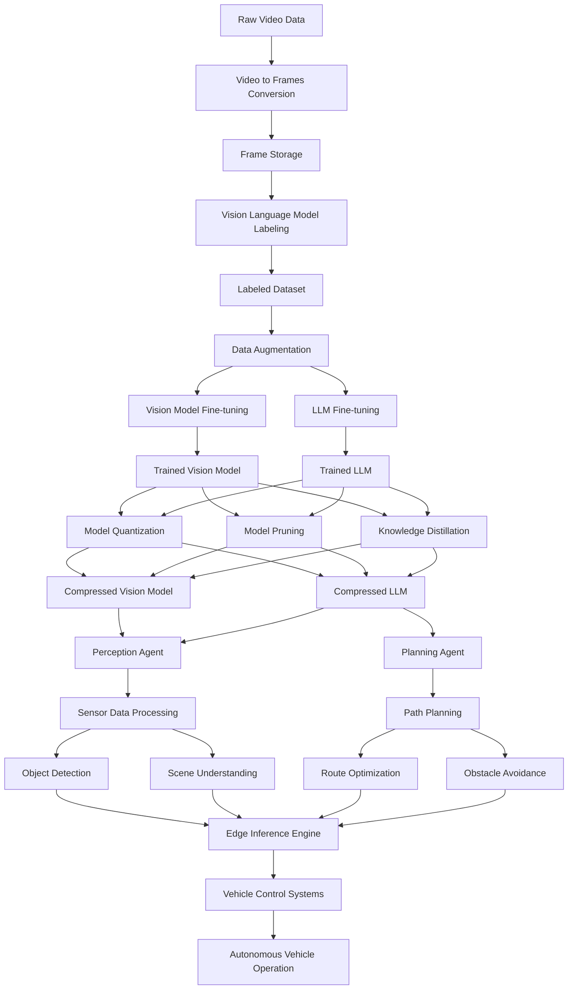

# Autonomous Vehicle End-to-End AI System

This project implements an end-to-end AI system for autonomous vehicle perception and path planning. It includes data processing, model training, model compression, and deployment to edge devices.

## Project Overview

1. **Data Processing**: Convert video files into labeled datasets using Vision Language Models.
2. **Model Training**: Fine-tune large vision models for perception tasks.
3. **Agent Framework**: Implement perception and planning agents using LangGraph, AutoGen, or Crew AI.
4. **Model Compression**: Apply quantization, pruning, and knowledge distillation for edge deployment.
5. **Edge Deployment**: Deploy compressed models for inference on edge devices.

## Features

- Video to labeled dataset conversion
- Vision model fine-tuning
- LLM integration for complex reasoning
- Agent-based framework for perception and planning
- Model compression techniques
- Edge device deployment

## Requirements

- Python 3.8+
- PyTorch
- OpenCV
- Transformers
- LangGraph/AutoGen/Crew AI
- OpenVINO (for edge deployment)

## Installation

1. Clone the repository:
   ```
   git clone https://github.com/varunvaidhiya/Foundation-Models-for-Automated-Driving
   cd Foundation-Models-for-Automated-Driving
   ```

2. Install required packages:
   ```
   pip install -r requirements.txt
   ```

3. Set up environment variables in a `.env` file:
   ```
   OPENAI_API_KEY=your_api_key_here
   ```

## Usage

1. Data Processing:
   ```
   python src/data_processing/video_to_frames.py
   python src/data_processing/labeling.py
   ```

2. Model Training:
   ```
   python src/model_training/vision_model_finetuning.py
   python src/model_training/llm_finetuning.py
   ```

3. Model Compression:
   ```
   python src/model_compression/quantization.py
   python src/model_compression/pruning.py
   python src/model_compression/knowledge_distillation.py
   ```

4. Agent Framework:
   ```
   python src/agent_framework/perception_agent.py
   python src/agent_framework/planning_agent.py
   ```

5. Edge Deployment:
   ```
   python src/edge_deployment/inference.py
   ```

## Configuration

Edit the YAML files in the `configs/` directory to customize:
- Data processing parameters
- Model architecture and training hyperparameters
- Agent framework settings
- Deployment configurations

## Project Structure


## Code Structure  
```
autonomous-vehicle-ai/
│
├── data/
│   ├── raw/
│   ├── processed/
│   └── labeled/
│
├── models/
│   ├── vision_model/
│   ├── llm/
│   └── compressed/
│
├── src/
│   ├── data_processing/
│   │   ├── __init__.py
│   │   ├── video_to_frames.py
│   │   └── labeling.py
│   │
│   ├── model_training/
│   │   ├── __init__.py
│   │   ├── vision_model_finetuning.py
│   │   └── llm_finetuning.py
│   │
│   ├── model_compression/
│   │   ├── __init__.py
│   │   ├── quantization.py
│   │   ├── pruning.py
│   │   └── knowledge_distillation.py
│   │
│   ├── agent_framework/
│   │   ├── __init__.py
│   │   ├── perception_agent.py
│   │   └── planning_agent.py
│   │
│   └── edge_deployment/
│       ├── __init__.py
│       └── inference.py
│
├── notebooks/
│   ├── data_exploration.ipynb
│   ├── model_evaluation.ipynb
│   └── compression_analysis.ipynb
│
├── tests/
│   ├── test_data_processing.py
│   ├── test_model_training.py
│   ├── test_model_compression.py
│   └── test_agent_framework.py
│
├── configs/
│   ├── data_config.yaml
│   ├── model_config.yaml
│   ├── agent_config.yaml
│   └── deployment_config.yaml
│
├── requirements.txt
├── setup.py
├── README.md
└── .gitignore
```

## Contributing

Contributions are welcome! Please feel free to submit a Pull Request.

## Note

I will be actively working on the project till September 2024 . Please star and Watch the repo inorder to stay updated 
-Thanks 

